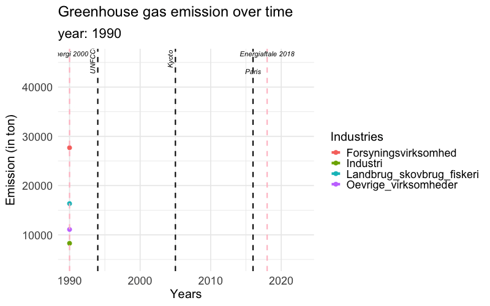

```{r setup, include=FALSE}
# Activate tidyverse, gganimate, gifski, gapminder
#install.packages("tidyverse")
#install.packages("gganimate")
#install.packages("gifski")
#install.packages("gapminder")
#install.packages("ggplot2")

library(tidyverse)
library(gganimate)
library(gifski)
library(gapminder)
library(ggplot2)
```

```{r indlæsning_af_data}
udledning <- read_csv2("data/Udledning.csv")
udledning <- udledning[1:4,]
udledning
```

```{r ombygning_af_data}
# 4. Tjek kolonnenavne – første kolonne skal hedde "Kategori"
colnames(udledning)[1] <- "Kategori"

# 5. Omform data til long format (fra bred -> lang)
udledning_long <- pivot_longer(
  udledning,
  cols = -Kategori,
  names_to = "Aar",
  values_to = "Udledning"
)

# 6. Gør årstal og udledning numeriske
udledning_long$Aar <- as.integer(udledning_long$Aar)
udledning_long$Udledning <- as.numeric(udledning_long$Udledning)
```


```{r kurvediagram}
ggplot(udledning_long, aes(x = Aar, y = Udledning, color=Kategori)) +
  geom_line(size = 1.2) +
  labs(
   title = 'Greenhouse gas emission over time',
    x = 'Years',
    y = 'Emission (in ton)',
    color = 'Industries'
  ) +
  theme_minimal()

```


```{r ggplot}
anim <- ggplot(udledning_long, aes(x = Aar, y = Udledning, color = Kategori, group = Kategori)) +
  geom_line(size = 1.2) +
  geom_point(size = 2) +
  labs(title = 'Udledning af drivhusgasser: {closest_state}',
       x = 'År',
       y = 'Udledning (i ton)',
       color = 'Sektor') +
  theme_minimal() +
  transition_states(Aar, transition_length = 1, state_length = 1) +
  ease_aes('linear')

```

```{r animation}

# Brug transition_reveal til at tegne linjen over tid
anim <- ggplot(udledning_long, aes(x = Aar, y = Udledning, color = Kategori, group = Kategori)) +
  geom_line(size = 1.2) +
  geom_point(size = 2) +
  labs(
    title = 'Greenhouse gas emission over time',
    subtitle = 'year: {frame_along}',
    x = 'Years',
    y = 'Emission (tons)',
    color = 'Industries') +
  ) 
  transition_reveal(along = Aar) +
  theme_minimal() +
  transition_reveal(along = Aar)

animate(anim, fps = 5, duration = 10, width = 800, height = 500, renderer = gifski_renderer())


```

```{r med nedslag}
anim2 <- ggplot(udledning_long, aes(x = Aar, y = Udledning, color = Kategori, group = Kategori)) +
  geom_line(size = 2) +
  geom_point(size = 3) +
  geom_vline(xintercept = 2005, linetype = "dashed", color = "black", size = 1) +  # Lodret linje
  annotate("text", x = 2005, y = max(udledning_long$Udledning, na.rm = TRUE), 
           label = "Kyoto", angle = 90, vjust = -0.5, size = 4, fontface = "italic") +
  
  geom_vline(xintercept = 2016, linetype = "dashed", color = "black", size = 1) +  # Lodret linje
  annotate("text", x = 2016, y = max(udledning_long$Udledning, na.rm = TRUE), 
           label = "Paris", angle = 0, vjust = 3, size = 4, fontface = "italic") +
  
  geom_vline(xintercept = 1994, linetype = "dashed", color = "black", size = 1) +  # Lodret linje
  annotate("text", x = 1994, y = max(udledning_long$Udledning, na.rm = TRUE), 
           label = "UNFCCC", angle = 90, vjust = -0.5, size = 4, fontface = "italic") +
  
  geom_vline(xintercept = 1990, linetype = "dashed", color = "pink", size = 1) +  # Lodret linje
  annotate("text", x = 1990, y = max(udledning_long$Udledning, na.rm = TRUE), 
           label = "Energi 2000", angle = 0, vjust = -0.5, size = 4, fontface = "italic") +
  geom_vline(xintercept = 2018, linetype = "dashed", color = "pink", size = 1) +  # Lodret linje
  annotate("text", x = 2018, y = max(udledning_long$Udledning, na.rm = TRUE), 
           label = "Energiaftale 2018", angle = 0, vjust = -0.5, size = 4, fontface = "italic") +
  
  labs(
    title = 'Greenhouse gas emission over time',
    subtitle = 'year: {frame_along}',
    x = 'Years',
    y = 'Emission (in ton)',
    color = 'Industries'
  ) +
  theme_minimal(base_size = 18) +  # Øger basisskriftstørrelse
theme(
  plot.title = element_text(size = 24, face = "bold"),
  plot.subtitle = element_text(size = 22),
  axis.title = element_text(size = 20),
  axis.text = element_text(size = 18),
  legend.title = element_text(size = 20),
  legend.text = element_text(size = 18)
)+
  transition_reveal(along = Aar)

animate(anim2, fps = 5, duration = 10, width = 800, height = 500, renderer = gifski_renderer())

```
```{r saving_gif}
anim_obj <- animate(anim2, fps = 5, duration = 10, width = 800, height = 500, renderer = gifski_renderer())
anim_save("udledning.gif", animation = anim_obj)

```
### Animation af udledning



